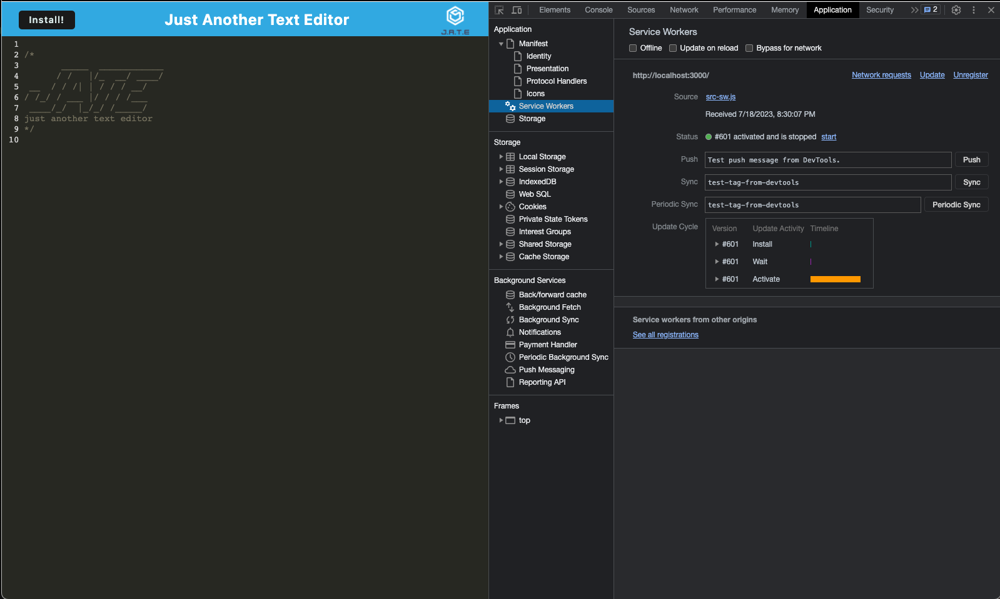

# Oh-JATE
Progressive Web Applications (PWA): Text Editor

## Table of Contents

- [Description](#description)
- [User Story](#user-story)
- [Acceptance Criteria](#acceptance-criteria)
- [Preview Images](#preview-images) 
- [Link To Live URL](#link-to-live-url)
- [Installation and Usage](#installation-and-usage)
- [Tests](#tests)
- [Technologies Used](#technologies-used)
- [Credits](#credits)
- [License](#license)

## Description

This is a web-based text editor that enables users to create notes or code snippets both online and offline. Thanks to the integrated service worker and Cache API, the app remains fully functional without an active internet connection, ensuring reliable access to saved content and visited pages even in offline mode.

## User Story

```md
AS A developer
I WANT to create notes or code snippets with or without an internet connection
SO THAT I can reliably retrieve them for later use
```

## Acceptance Criteria

```md
GIVEN a text editor web application
WHEN I open my application in my editor
THEN I should see a client server folder structure
WHEN I run `npm run start` from the root directory
THEN I find that my application should start up the backend and serve the client
WHEN I run the text editor application from my terminal
THEN I find that my JavaScript files have been bundled using webpack
WHEN I run my webpack plugins
THEN I find that I have a generated HTML file, service worker, and a manifest file
WHEN I use next-gen JavaScript in my application
THEN I find that the text editor still functions in the browser without errors
WHEN I open the text editor
THEN I find that IndexedDB has immediately created a database storage
WHEN I enter content and subsequently click off of the DOM window
THEN I find that the content in the text editor has been saved with IndexedDB
WHEN I reopen the text editor after closing it
THEN I find that the content in the text editor has been retrieved from our IndexedDB
WHEN I click on the Install button
THEN I download my web application as an icon on my desktop
WHEN I load my web application
THEN I should have a registered service worker using workbox
WHEN I register a service worker
THEN I should have my static assets pre cached upon loading along with subsequent pages and static assets
WHEN I deploy to Heroku
THEN I should have proper build scripts for a webpack application
```

## Preview Images
- ## Preview - JATE


- ## Preview - Manifest


- ## Preview - Service Workers


- ## Preview - Storage


- ## Preview - Local Storage


- ## Preview - Install Offline App


## Link To Live URL

**Oh JATE on Heroku:** [Link To Live URL](https://oh-jate-df48566a1d41.herokuapp.com/) 
### this application is deployed live via Heroku, and can be accessed via the link above.
- ## Preview - Live On Heroku


## Installation and Usage
- To clone the repo: https://github.com/cynthiamory/Oh-JATE.git
- Install [Node](https://nodejs.org/en). version 16 and up. Command line: 
```bash
npm init
```
#### Install Dependencies the root of the directory using the command:
```bash
npm install
```
#### Run the application to initiate the server using Command at the root of the directory: 
```bash
npm run start:dev
```

## Tests
- There are no tests yet for this application

## Technologies Used
Assignment was built with:


## Credits
- Oh JATE: Cynthia Morales - Full Stack Developer Student.
- Institution: The University Of Toronto
- Course: Bootcamp Full Stack Development
- Instructor: Ali Masqood 
- Tutor: Jose Lopez 
- Learing Assistant Ask BCS Support: Benicio aka blopez on Slack
- Online Support: W3Schools, Youtube, Stack Overflow
- License badges: Sheilds.io


## License

